  

  
  
  

---

### 🚀 What I'm building: GitFekra

**GitFekra (جِت فِكرة)** is a software company I co-founded to build education platforms for private teachers in Egypt. Each teacher gets their own branded platform, with their name, logo, colours and custom domain, all running on one shared, multi-tenant system.

- 🏫 **Multi-tenant architecture.** One React app and one database serve every teacher. Each tenant resolves from its own domain and gets its own theme, features and content.
- 🔐 **Security first.** PostgreSQL Row-Level Security isolates every tenant's data. Server-side rules enforce exam attempts, content locks and device limits, and privileged actions run through audited RPCs.
- 🎓 **Full teaching workflow.** Course lectures with prerequisite locks, online exams with instant grading and new question types, homework, attendance with barcode cards, grades, payments and packages, chat, and parent reports.
- 📱 **Web + Android.** The same app ships as an Android app via Capacitor.
- 🌍 **Per-domain SEO.** Every teacher's domain gets its own search metadata, sitemap and robots file at build time.

Platforms are live today for teachers across English, Programming & AI, Mathematics and Arabic, with 1,500+ students using them.

### 🛠️ Tech I work with

  
  
  
  
  
  
  
  
  
  
  
  

### 🎯 Focus areas

- **Full-stack web development:** React SPAs, serverless edge functions, PostgreSQL design
- **Application security:** RLS policy design, access control, securing multi-tenant systems
- **Cybersecurity:** hands-on labs and penetration-testing practice
- **Data analytics:** Power BI dashboards and data modelling (DEPI, Microsoft Power BI track)

### 🏆 Highlights

- Co-founded GitFekra and took it from idea to live platforms used daily by students
- Honored at the **Digital Egypt Pioneers Initiative (DEPI)** top-performers ceremony, El-Beheira (MCIT)
- Completed the DEPI **Microsoft Power BI Specialist** track and led the capstone team

---

<i>Open to freelance and collaboration on web platforms and secure backends. Let's talk!</i>

